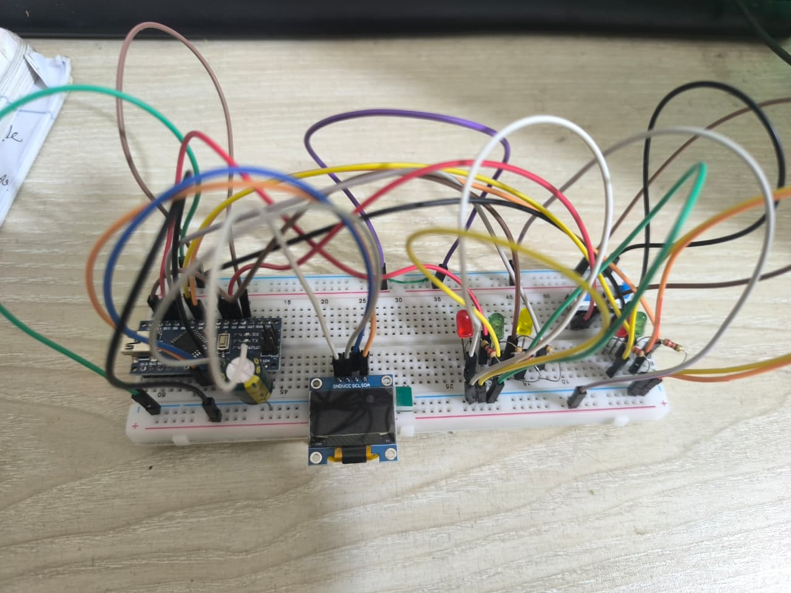
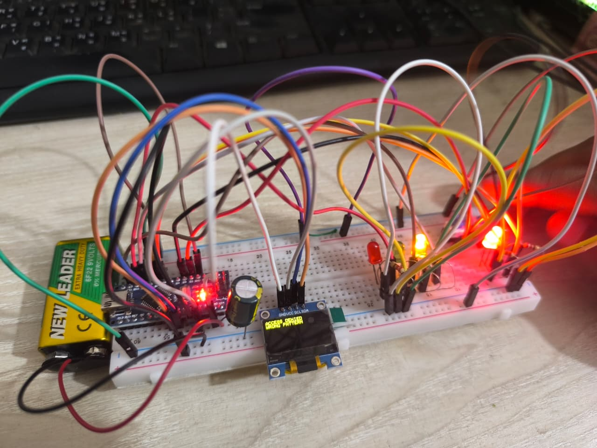
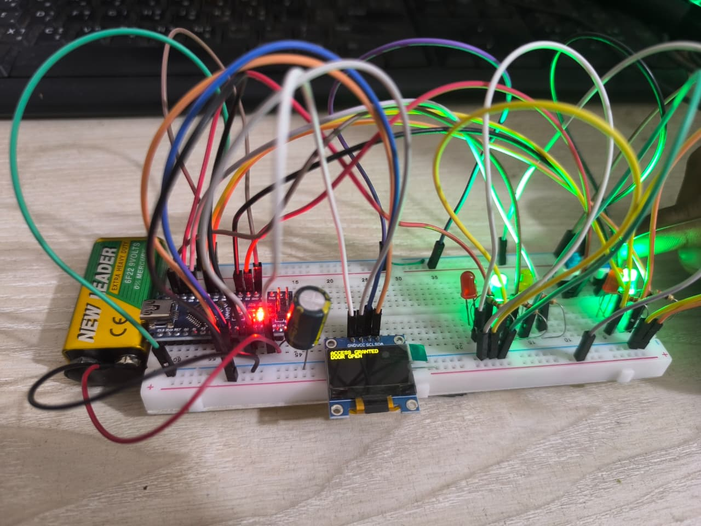

# LED Pattern Door Lock System using Arduino Nano

## Project Overview
The LED Pattern Door Lock System is an interactive electronic project built with an Arduino Nano and a 0.96″ I²C OLED display. The system allows users to unlock a virtual “door” by entering a predefined LED color sequence using push buttons.

This project showcases embedded system design, user interface with OLED, button input handling, and visual feedback with LEDs, making it a strong portfolio demonstration.

---

## Features
- Interactive LED-based input system for password entry  
- Real-time feedback on a 0.96″ I²C OLED display  
- Success and failure indication with LEDs  
- Fully debounced push buttons for reliable input  
- Configurable password sequence  
- Timeout reset for inactivity  

---

## Components Used
- Arduino Nano  
- 0.96″ I²C OLED Display (128×64)  
- LEDs (Yellow, Red, Green)  
- Indicator LEDs (Green for success, Red for failure)  
- Push Buttons (Select & Enter)  
- Resistors and basic electronics components  

---

## Demonstration

### User Interaction
Users select colors using a button and confirm each choice with another button. Once the full password sequence is entered, the system validates it and provides visual feedback:

- ✅ **Success:** OLED shows “ACCESS GRANTED”, green LED lights  
- ❌ **Failure:** OLED shows “ACCESS DENIED”, red LED flashes  

### Visual Feedback
The OLED displays the current selection and the sequence entered so far, making the interface intuitive and interactive.

---

## Showcase Images
### Project Setup

### OutPut Display

---

## Skills Demonstrated
- Microcontroller programming (Arduino, C/C++)  
- Embedded system design and debugging  
- User interface with OLED display  
- LED-based output and real-time feedback  

---

## Technologies Used
- Arduino Nano  
- 0.96″ I²C OLED display  
- Adafruit SSD1306 & GFX libraries for OLED  
- Push buttons and LEDs
